# IoT Temperature, Humidity & Condensation Alert System

IoT Project winter semester 2025/26

## Components
### Hardware
- Microcontroller ESP8266
- DHT22 Temperature & Humdity Sensor
- Raspberry Pi 3

### Software
- Node-Red
    + Telegram Nodes       
    + String Node
    + Dashboard Nodes
    + Function Nodes
    + Parser Nodes
- Mosquitto Broker

## 🌡️ ESP8266 DHT22 MQTT Sensor Publisher (MicroPython)

This project runs on an **ESP8266 using MicroPython** and reads temperature and humidity data from a **DHT22 sensor**, then publishes the values to an **MQTT broker**.  
It also reports its **online/offline status** using MQTT Last Will and Testament (LWT).


### 📦 Features

- Connects ESP32 to WiFi
- Reads temperature & humidity from a **DHT22 sensor**
- Publishes sensor data to MQTT topics
- Uses **MQTT Last Will** to detect unexpected disconnects and publishes device **online/offline status**

### 📚 Software Dependencies

- MicroPython firmware
- Modules used:
  - `network`
  - `machine`
  - `dht`
  - `umqtt.simple`
  - `ujson`

### ⚙️ Configuration

All credentials and MQTT topics are stored in a separate `config.py` file.

Example `config.py` structure:

```python
MQTT_client_id = "esp32_001"
MQTT_broker = "your.mqtt.broker"
MQTT_userName = "mqtt_user"
MQTT_password = "mqtt_password"

MQTT_topic_base = "iot/esp32"
MQTT_topic_temp = "iot/esp32/temperature"
MQTT_topic_humi = "iot/esp32/humidity"
MQTT_topic_status = "iot/esp32/status"

Wifi_NAME = "your_wifi_ssid"
Wifi_PASSWORD = "your_wifi_password"
```
#### 🔐 MQTT Authentication Configuration

To enhance security, **MQTT username and password authentication** was enabled on the Mosquitto broker.

This was achieved by modifying the Mosquitto configuration file located at: /etc/mosquitto/mosquitto.conf

The following configuration directives were added:

```conf
allow_anonymous false
password_file /etc/mosquitto/passwd
listener 1883
```
### 🔄 Program Execution Flow

The following lines of code are required to read out the sensor values. The DHT Sensor is connected to pin 2.

```python
sensor = dht.DHT22(Pin(2))
sensor.measure() 
mytemp= sensor.temperature()
myhumi = sensor.humidity()
```

A wifi-connection is established using:
```python
sta_if = network.WLAN(network.STA_IF)
sta_if.active(True)
sta_if.connect(config.Wifi_NAME, config.Wifi_PASSWORD)
```
And the connection with the MQTT broker with lastWill message:
```
client = MQTTClient(
    MQTT_CLIENT_ID,
    MQTT_BROKER,
    user = MQTT_USER,
    password = MQTT_PASSWORD,
    keepalive=60) 

client.set_last_will(topic=MQTT_TOPIC_STATUS, msg= status_offline_msg, retain=True)
client.connect()    
```
publishing messages via MQTT Broker and to announce status of the connection:
```python
client.publish(MQTT_TOPIC_STATUS, msg= status_online_msg , retain=True)
client.publish(MQTT_TOPIC_TEMP, str(mytemp))
client.publish(MQTT_TOPIC_HUMI, str(myhumi))
```
## Node Red Flow

This Node-RED flow is designed to publish temperature and humidity data from IoT devices (local mosquitto) to an MQTT broker(public university broker) and display the values on dashboard gauges in real time as shown in *Figure 1* and corresponding dashboard outlook is shown in *Figure 1.1*

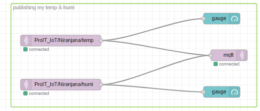
*Figure 1:  Flow showing temperature and humidity gauges.*

The flow contains two main data streams:  
  + Temperature 
  + Humidity

##### Temperature Stream:
+ The ```ProlT_IoT/Niranjana/temp``` MQTT node receives temperature readings from the IoT device.
+ The temperature value is sent to:
    + A **_dashboard gauge_**, allowing users to visualize the temperature in real time.
    + An **_MQTT output_** node, which republishes the value to a broker for further processing or logging.
##### Humidity Stream:
+ The ```ProlT_IoT/Niranjana/humi``` MQTT node receives humidity readings from the IoT device.
+ The humidity value is sent to:
    + A **_dashboard gauge_** allowing users to visualize the humidity in real time.
    + An **_MQTT output_** node, which republishes the value to a broker for further processing or logging.


 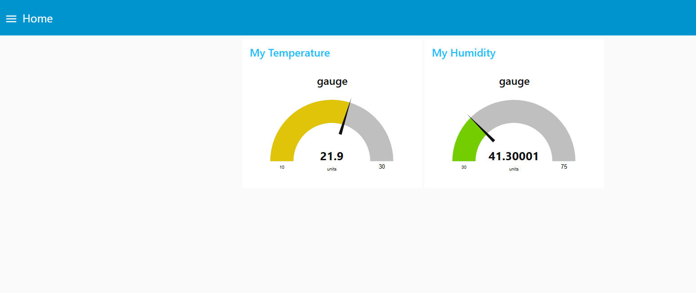

*Figure 1.1: Dashboard presenting temperature and humidity measurements using gauge.*

---

#### Sensor Data Processing and User Filtering

This Node-RED flow is designed to subscribe to the university-hosted MQTT broker to receive real-time  sensor measurements, process the incoming data, and present it visually through dashboards. 

The flow also allows users to filter and select specific sensor. 

The overall Node-RED flow diagram is illustrated in *Figure 2.*


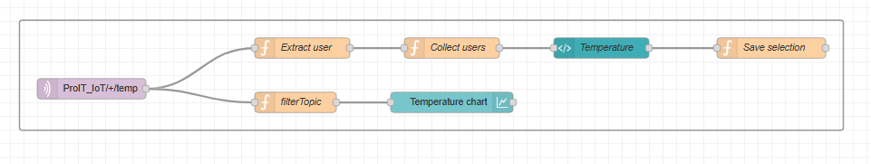
  *Figure 2: Node-RED flow for MQTT sensor data subscription and visualization*

##### MQTT Subscription
The flow begins with an MQTT input node that subscribes to a university-hosted MQTT broker. This broker publishes data from multiple sensors, under different topics. Once connected, the MQTT node continuously receives sensor data and forwards it to downstream processing nodes.  

##### Data Processing and User Filtering
After receiving the data, the flow splits into two logical paths:
+ **User Selection and Filtering Path**
    | Dashboard Image | Node Description |
    |-----------------|-------------|
    |   | The Extract User node processes the incoming MQTT messages to identify sensor-specific information such as name of the sensor. |

     
    | Dashboard Image | Node Description |
    |-----------------|-------------|
    | 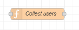  | This code maintains a  list of sensor-associated users by adding new entries to the flow context while preventing duplicates. The updated list is immediately sent downstream to refresh the user interface and preserve previously selected users.|

    | Dashboard Image | Node Description |
    |-----------------|-------------|
    | 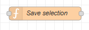  | This code stores sensor data and user selections in memory so they can be reused. It reloads the saved data when the dashboard is opened or when the tabs are switched and updates the stored selections when the user submits them. |

    | Dashboard Image | Node Description |
    |-----------------|-------------|
    | 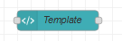  | This Node-RED ui_template is built using HTML + AngularJS. This dashboard code displays a list of users with checkboxes, allowing the user to select, deselect, or submit multiple entries easily |
    
    
    

+ **Visualization Path**
    | Dashboard Image | Node Description |
    |-----------------|-------------|
    | 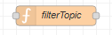  | This code dynamically updates a chart based on the users selected in the dashboard. It stores and maintains one hour of historical data per selected user, clears the chart when no users are selected, and continuously refreshes the chart with synchronized time-series data for all active users.|

    | Dashboard Image | Node Description |
    |-----------------|-------------|
    | 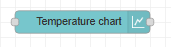  | This chart provides users with a real-time temperature and humidity trends. |

The dashboard show the selection of specific sensors for both temperature and humidity as shown in the *Figure 3*.

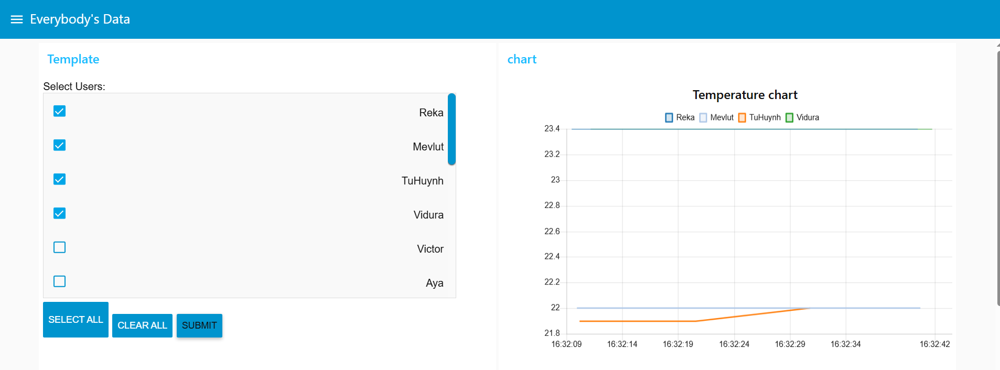
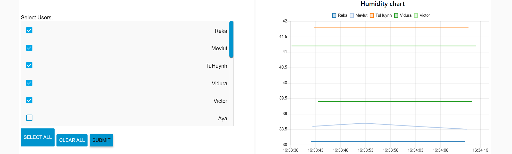
*Figure 3:User selection*

### Temperature and Humidity alerts

This Node-RED flow is designed to monitor temperature and humidity data and send targeted notifications to a Telegram bot based on specific threshold conditions as shown in the *Figure 4 & 4.1*

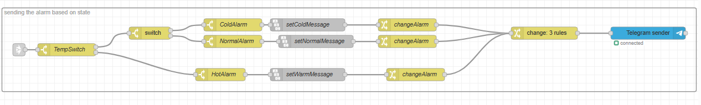
*Figure 4: Node-RED Logic Flow for Multi-State Temperature Monitoring and Telegram Notification*


*Figure 4.1: Node-RED Logic Flow for Multi-State Humidity Monitoring and Telegram Notification*

#### Logic and Classification Stage
The process begins with a primary logic gate, the **TempSwitch** and **HumiSwitch** node. This node separate the incoming `msg.payload`(the temperature and humidity value) into high path, then directs it down to another switch to divide either to reach normal path or low path.

+ *Cold Path*: Triggers when the temperature drops below a defined low threshold.
+ *Normal Path*:Activates when the temperature is within the desired operating range.
+ *Hot Path*:Triggers when the temperature exceeds a defined high threshold.

#### Message Payload Construction

Once a state is determined, the flow enters the **String** and **Change** node phase:

+ **Message Generation**: Nodes such as setColdMessage , setLowAlarm, setNormalMessage , and setWarmMessage define the specific text string that the user will see (eg,Temperature is too high!").
+ **Final Transformation**: This node modiefies the payload to send the message to the telegram sender.
#### Output and Notification
The flow concludes at the **Telegram sender** node. This node connects to the Telegram Bot API to deliver the formatted alert directly to the designated user or group as shown in *Figure 5.*

 


*Figure 5*
### Condensation Alerts

The Condensation Monitoring System is an automation flow designed to detect and alert users of moisture-related risks within an indoor environment. 

Unlike simple temperature monitoring, this system relies on the relationship between indoor humidity and the cooling effect of outdoor temperatures.

The flow is shown in *Figure 6 & 6.1*
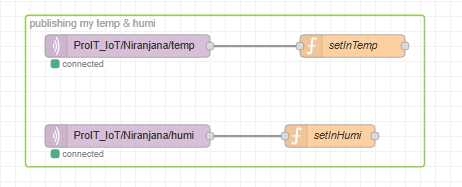
*Figure 6: Indoor data Acquisition*

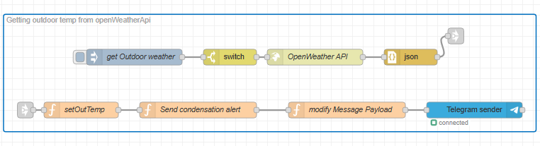
*Figure 6.1: External data and alert system*

#### Indoor Data Acquisition
The *Figure 6*, handles the real-time sensor data:
+ **MQTT Subscription**: The flow uses MQTT nodes to subscribe to indoor temperature and humidity topics (eg, `ProIT_IoT/Niranjana/temp` and `ProIT_IoT/Niranjana/humi`).


+ **Variable Storage**: The **setInTemp** and **setInHumi** function nodes process these values, storing them as flow-level variables (as `flow.set("inTemp", indoorTemp);`, `flow.set("inHumi", indoorHumi);`). So they can be accessed by other parts for comparison.
  
#### External Data
+ **External API Integration**: In *figure 6.1*, the flow triggers (every 20 mins) a request via the OpenWeather API node to retrieve current local (Treptow-Köpenick) outdoor weather conditions.
+ **Condensation Alert check**: The **switch node** in *figure 6.1*, verifies wether the user has enabled the condensation alert or not.
  
+ **Data Parsing**: An intermediate **JSON node** converts the API response into a readable object.
+ **Variable Storage**: The **setOutTemp**  function nodes process and store the values as flow-level variable (as `flow.set("outTemp", outdoorTemp);`)
  
#### Condensation Calulation

The **Send condensation alert** function node compares the indoor humidity and temperature against the outdoor temperature. Condensation typically occurs when warm, moist indoor air meets a surface cooled by outdoor temperatures.

```javascript
if (inHumi >= 70 && inTemp >= 19 && outTemp <= 5) {
    if(flow.get("highRisk")== false){
        flow.set("highRisk",true);
        flow.set("lowRisk", false);
        flow.set("normal", false);

        msg.payload =
        "🔴 High Condensation Risk\n\n" +
        "🏠 Indoor: " + inTemp + "°C | humidity: " + inHumi.toFixed(2) + "%\n" +
        "🌤️ Outdoor: " + outTemp + "°C\n\n" ;
        return msg;
    } 
}
```
The above code is executed to receive High-Risk Triggers.

A "High Risk" alert is generated only when three specific criteria are met simultaneously:

+ **Indoor Humidity**: The relative humidity inside the room is greater than or equal to **70%**.
+ **Indoor Temperature**: The internal temperature is at least **19°C** .
+ **Outdoor Temperature**: The exterior temperature, retrieved via the OpenWeather API, is **5°C or lower**

```javascript
else if (inHumi >= 60 && inHumi < 70 && inTemp >= 19 && outTemp <= 5) {
    if(flow.get("lowRisk")==false){
        flow.set("highRisk",false);
        flow.set("lowRisk", true);
        flow.set("normal", false);
        msg.payload =
        "🟡 Low Condensation Risk\n\n" +
        "🏠 Indoor: " + inTemp + "°C | humidity: " + inHumi.toFixed(2) + "%\n" +
        "🌤️ Outdoor: " + outTemp + "°C\n\n" ;
        return msg;
    }   
}
```
The above code is executed to receive Low-Risk Triggers.

A "Low Risk" alert is generated only when three specific criteria are met simultaneously:

+ **Indoor Humidity**: The relative humidity inside the room is greater than or equal to **60%** and less than  **70%**.
+ **Indoor Temperature**: The internal temperature is at least **19°C** .
+ **Outdoor Temperature**: The exterior temperature, retrieved via the OpenWeather API, is **5°C or lower**.

```javascript
else if(flow.get("normal")==false){
    flow.set("highRisk",false);
    flow.set("lowRisk", false);
    flow.set("normal", true);
    msg.payload =
    "🟢 Normal now \n\n" +
    "🏠 Indoor: " + inTemp + "°C | humidity: " + inHumi.toFixed(2) + "%\n" +
    "🌤️ Outdoor: " + outTemp + "°C\n\n" +
    "No risk of condensation now";
    return msg;
}
```
The ```else if``` block is triggered when the environment no longer meets the "High Risk" criteria. This section of the script manages the transition back to a baseline state.

+ **State Interlocking** : When the "High Risk" conditions are met, the system explicitly sets `highRisk` to `true` while forcing `lowRisk` and `normal` to `false`. On the other hand, When the "Low Risk" conditions are met, the system explicitly sets `lowRisk` to `true` while forcing `highRisk` and `normal` to `false`.
                          
+ **Recovery Synchronization** : Conversely, when the system enters the "Normal" state, it resets both `highRisk` and `lowRisk` to `false` before enabling the normal flag.
  
#### Inline Button Options
 + The function begins by extracting the incoming message content from `msg.payload`, which is reused as the notification text sent to the user.
 + When a **high-risk** or **low-risk** condition is detected:
    + A Telegram message is generated with an interactive inline keyboard.
    + The keyboard provides multiple user action options, including:
        + Viewing safety or mitigation tips.
        + Confirming that ventilation is currently being performed.
        + Ignoring the alert if no action is required.
    + When the system is in a **normal** state:
        + A notification is sent to the user about the current condition.
        + Only a single action option (“Show Tips”) is presented as a inline Button option.
  
  + The message payload is dynamically constructed based on the evaluated risk level and then returned for  to the telegram sender.
#### Telegram Callback Query Handling

This flow handles user responses to previously sent Telegram inline buttons by processing callback queries. Based on the selected option, the system routes the request to the appropriate response logic and sends a corresponding reply back to the user as shown in the *Figure 7*.

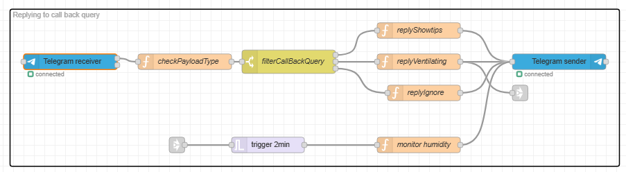
*Figure 7: Telegram Callback query Handling*

+ The flow begins with the **Telegram Receiver**, which listens for incoming callback queries generated when a user interacts with inline buttons.
+ The received payload is passed to the **payload type** validation stage, where the message is checked to confirm that it is a callback query .
+ A **callback query filter** node evaluates the callback data associated with the user’s button selection and routes the message accordingly.
+ Based on the user’s response, one of the following actions is triggered:
    + Show Tips : Sends safety recommendations back to the user.
    + Ventilating: Confirms that the user has initiated ventilation and updates the system state.
    + Ignore: Acknowledges the user’s decision without triggering further actions.
+ In case, user confirmed that ventilation has been initiated, a parallel humidity monitoring process will be started:
    + A timed trigger evaluates humidity levels for 2 minutes.
    + Once normal humidity levels are restored, the user is notified and the monitoring process is stopped.

The sample telegram messages are shown in *Figure 8*.

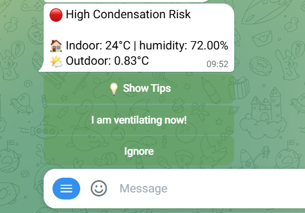
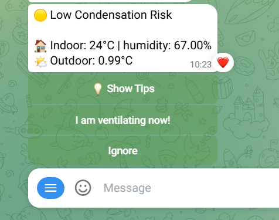


*Figure 8: Condensation risk alerts with inline button.*

The Telegram images illustrating the ‘Show Tips’ and ‘Ventilating’ responses are shown in *Figure 8.1*.

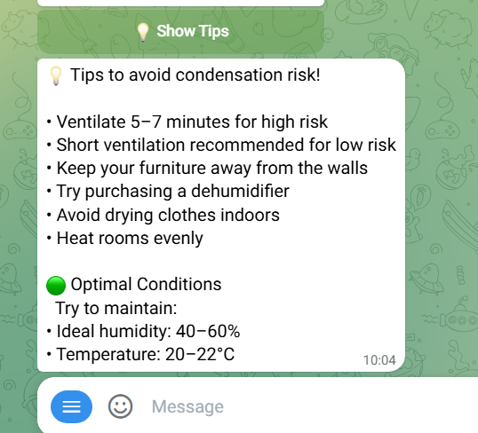
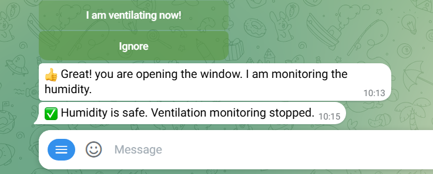

*Figure 8.1 : Inline button with responses*
#### Reply Keyboard

The Telegram reply keyboard incorporates a toggle-style control that enables users to activate or deactivate condensation alerts directly within the chat interface as shown in the *figure 9.*

Based on the indiactor status, the flow decides whether to send to condensation alert to the user or not.


*Figure 9: Toggle-style reply keyboard to enable and disable condensation alerts.*

The flow implements a **stateful toggle mechanism** using a global variable. It allows a user to interact with a Telegram bot to flip the status of a condensation alert system as shown in the *Figure 9.1.*

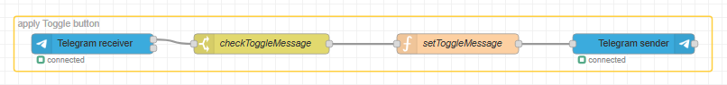
*Figure 9.1: Condensation alert Toggle.*

+ **Telegram Receiver:** Captures thefrom the user.
+ **checkToggleMessage (Switch Node)**: checks the incoming message to process only when "Condensation Alert" button is pressed.
+ **setToggleMessage (Function Node):** It performs three critical tasks:
    + **State Management**: Fetches the current boolean state from `global` memory.
    + **Inversion**: Flips the state.
    + **UI Preparation**: Builds the Telegram "Reply Keyboard" so the button label always shows the next possible action.
+ **Telegram Sender**: Dispatches the formatted message and keyboard back to the user.